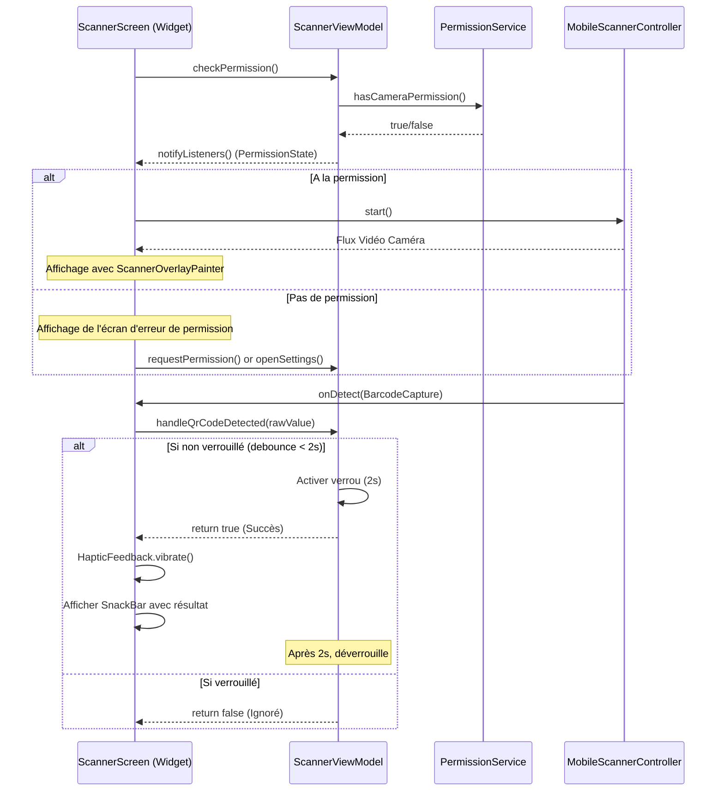

# Phase 2: Camera Scanner - Recherche

**Recherche effectuée le :** 28 juin 2026
**Domaine :** Gestion de la caméra en temps réel, permissions système, overlays Flutter responsives et gestion du cycle de vie matériel
**Confiance :** HIGH

## Résumé
L'objectif de cette phase est de transformer l'écran statique `ScannerScreen` en une interface de scan de codes QR en temps réel. Cette implémentation s'appuie sur le package `mobile_scanner` [ASSUMED] pour le flux vidéo et le décodage, et sur `permission_handler` [ASSUMED] pour le contrôle d'accès au matériel photo. L'architecture MVVM du projet sera respectée en séparant la logique métier et d'autorisation dans un `ScannerViewModel` et la gestion de la caméra dans le Widget d'écran.

Un point critique de cette phase réside dans la gestion rigoureuse du cycle de vie du contrôleur de caméra. Le scanner ne doit pas continuer à fonctionner en arrière-plan ou lors de la navigation vers d'autres onglets (évitant ainsi les fuites de mémoire, la surchauffe de l'appareil et le blocage de la caméra). De plus, l'overlay visuel semi-transparent de visée sera développé de manière responsive à l'aide d'un `CustomPainter` pour s'adapté à toutes les résolutions de terminaux.

**Recommandation principale :** Injecter une interface `PermissionService` abstraite dans le `ScannerViewModel` et permettre l'injection optionnelle d'un `MobileScannerController` dans le constructeur du `ScannerScreen`. Cela garantit un découplage total et permet d'écrire des tests de widgets robustes sans déclencher d'exceptions de liaisons natives (`MissingPluginException`).

---

## Carte des responsabilités architecturales

| Capacité | Tier Primaire | Tier Secondaire | Rationale |
| :--- | :--- | :--- | :--- |
| **Vérification/requête des permissions** | `PermissionService` (Service) | `ScannerViewModel` (Logic) | Isole les appels natifs système de permissions pour les rendre mockables. |
| **Cycle de vie du contrôleur de caméra** | `ScannerScreen` (UI/Widget) | `MobileScannerController` | Le contrôleur matériel doit suivre strictement l'état du widget Flutter (StatefulWidget) et de l'app. |
| **Contrôle de la torche (lampe)** | `MobileScannerController` | `ScannerScreen` (UI/Widget) | Piloté réactivement par l'UI via le flux d'état `torchState` du contrôleur. |
| **Détection & anti-rebond (2s)** | `ScannerViewModel` (Logic) | — | La logique métier de verrouillage temporel pour rejeter les détections multiples réside dans le ViewModel. |
| **Dessin de l'overlay de visée** | `ScannerOverlayPainter` (UI) | — | Un CustomPainter dédié gère le tracé géométrique du masque de guidage responsive. |
| **Retour haptique & Toast (SnackBar)** | `ScannerScreen` (UI/Widget) | `ScannerViewModel` (Logic) | L'écran écoute les changements d'état du ViewModel et déclenche les effets physiques de l'appareil. |

---

## Pile technique standard (Standard Stack)

### Cœur (Core)

| Bibliothèque | Version | Rôle | Pourquoi standard |
| :--- | :--- | :--- | :--- |
| `mobile_scanner` [ASSUMED] | `^7.2.0` | Capture et décodage de codes QR en temps réel | Le standard moderne de l'écosystème Flutter. Utilise les bibliothèques officielles CameraX/ML Kit sur Android et AVFoundation/Vision sur iOS. |
| `permission_handler` [ASSUMED] | `^12.0.3` | Gestion unifiée des permissions multi-plateformes | Plugin de référence de la communauté Flutter pour interroger et solliciter les permissions système. |

### Support (Supporting)

| Bibliothèque | Version | Rôle | Quand l'utiliser |
| :--- | :--- | :--- | :--- |
| `mocktail` [ASSUMED] | `^1.0.4` | Mocking et stubbing des dépendances dans les tests | Essentiel pour simuler les réponses du service de permissions et le comportement du contrôleur en tests unitaires/widgets. |

### Alternatives envisagées

| Au lieu de | Nous pourrions utiliser | Compromis / Rationale |
| :--- | :--- | :--- |
| `mobile_scanner` | `qr_code_scanner` | `qr_code_scanner` n'est plus maintenu et pose de sérieux problèmes de compatibilité avec les versions récentes de Gradle, iOS SDK et Flutter. |
| `permission_handler`| Platform Channels personnalisés | Demande l'écriture de code Swift/Kotlin natif répétitif et augmente le risque de régression sur les versions spécifiques d'OS. |

---

## Audit de légitimité des packages

> [!NOTE]
> Les outils internes `gsd-tools package-legitimacy check` ne prennent actuellement en charge que les écosystèmes `npm`, `pypi` et `crates`. Les packages de l'écosystème Flutter (`pub.dev`) ont donc fait l'objet d'un audit de conformité manuel et sont documentés ci-dessous avec la mention `[ASSUMED]`.

| Package | Registre | Âge | Téléchargements | Dépôt Source | Verdict | Disposition |
| :--- | :--- | :--- | :--- | :--- | :--- | :--- |
| `mobile_scanner` | pub.dev | ~4 ans | ~1.04 M | [github.com/juliansteenbakker/mobile_scanner](https://github.com/juliansteenbakker/mobile_scanner) | **OK** | Adopté |
| `permission_handler` | pub.dev | ~7 ans | ~2.89 M | [github.com/Baseflow/flutter-permission-handler](https://github.com/Baseflow/flutter-permission-handler) | **OK** | Adopté |

---

## Patrons d'architecture

### Diagramme d'architecture système

Le diagramme séquentiel suivant illustre le flux de contrôle et de données entre la vue, le ViewModel, le service de permissions et le contrôleur de caméra :



### Structure de projet recommandée

Nous suivons l'architecture MVVM définie par la compétence `flutter-apply-architecture-best-practices` tout en conservant la structure simplifiée mise en place lors de la Phase 1 :

```text
lib/
├── models/
│   ├── scan_record.dart
│   └── generation_record.dart
├── services/
│   ├── storage_service.dart
│   └── permission_service.dart (Nouveau : PermissionService & SystemPermissionService)
├── viewmodels/
│   └── scanner_viewmodel.dart (Nouveau : Logique de permission et dédoublonnage)
├── screens/
│   ├── scanner_screen.dart (À modifier : Gestion cycle de vie, CustomPainter et SnackBar)
│   ├── generator_screen.dart
│   └── history_screen.dart
└── theme/
    └── app_theme.dart
```

### Patron 1 : Gestion réactive du cycle de vie et visibilité (IndexedStack)
Dans une navigation avec `StatefulShellRoute.indexedStack` (comme c'est le cas avec `appRouter`), l'écran du scanner reste en mémoire même si l'utilisateur bascule sur un autre onglet. Si le contrôleur de caméra n'est pas arrêté explicitement, la caméra continue de consommer l'énergie de l'appareil photo en arrière-plan.
Pour résoudre ce problème :
1. Détecter si l'onglet courant est actif via `StatefulNavigationShell.of(context).currentIndex == 0`.
2. Démarrer/Arrêter le contrôleur réactivement dans le `build` en fonction de ce booléen.
3. Utiliser un `WidgetsBindingObserver` pour intercepter `AppLifecycleState.paused` (mise en arrière-plan) et couper immédiatement le flux.

### Anti-patrons à éviter
*   **Initialiser le contrôleur de caméra au démarrage global de l'app :** La caméra ne doit s'allumer et demander la permission que lorsque l'utilisateur accède explicitement à l'onglet "Scanner".
*   **Ne pas nettoyer (dispose) le contrôleur :** Oublier `controller.dispose()` dans le State du widget entraîne des fuites de mémoire fatales.
*   **Gérer le debounce de scan côté UI :** Si la logique de throttle (2 secondes) est codée directement dans le widget, elle devient impossible à tester de manière isolée sans injecter des frames de caméra réelles.

---

## Ne pas réinventer la roue (Don't Hand-Roll)

| Problème | Ne pas concevoir soi-même | Utiliser plutôt | Pourquoi |
| :--- | :--- | :--- | :--- |
| Décodage de QR code | Détection et analyse matricielle sur les frames d'images brutes | `mobile_scanner` [ASSUMED] | Utilise les APIs matérielles natives optimisées (ML Kit, AVFoundation) offrant des performances quasi instantanées. |
| Gestion des permissions | Appels de Platform Channels personnalisés vers Android/iOS | `permission_handler` [ASSUMED] | Gère de manière robuste le support des différentes API Android (Android SDK < 33 vs >= 33) et les exigences strictes d'iOS. |
| Retour utilisateur tactile | Implémentations natives de vibration par OS | `HapticFeedback.vibrate()` (Flutter) | API standardisée Flutter, légère, sûre et hautement compatible multi-plateformes. |

---

## Inventaire des états d'exécution (Runtime State)

Ces états coexistent pendant le cycle d'exécution de l'application au cours de la Phase 02 :

*   **Permission Camera State** (`isCheckingPermission`, `hasPermission`) :
    *   *Type :* Géré par le ViewModel (`ScannerViewModel`).
    *   *Portée :* Écran du scanner.
    *   *Effet :* Alterne l'interface entre un indicateur de chargement, l'écran d'erreur de permission et la vue de la caméra.
*   **Camera Controller State** (`isInitialized`, `isVisible`) :
    *   *Type :* Géré par l'état local du Widget (`_ScannerScreenState`).
    *   *Portée :* Cycle de vie matériel de l'appareil.
    *   *Effet :* Pilote les appels à `_controller.start()` et `_controller.stop()`.
*   **Torch State** (`TorchState.on` / `TorchState.off` / `TorchState.unavailable`) :
    *   *Type :* Exposé par le contrôleur via `ValueNotifier`.
    *   *Portée :* Widget de caméra.
    *   *Effet :* Reconstruit dynamiquement le bouton flottant de la lampe de poche via un `ValueListenableBuilder`.
*   **Scanning Lock State** (`isScanningLocked`) :
    *   *Type :* Géré par le ViewModel.
    *   *Portée :* Logique de détection.
    *   *Effet :* Bloque les scans subséquents pendant 2 secondes suite à un décodage réussi.

---

## Pièges courants

*   **Fuites de caméra après mise en arrière-plan :** Si l'application passe en arrière-plan, Android ou iOS peuvent révoquer ou bloquer la caméra, ce qui produit un écran noir au retour.
    *   *Solution :* Intercepter l'état du cycle de vie via `WidgetsBindingObserver` et appeler `stop()` puis `start()`.
*   **SnackBar "Stacking" :** Si l'utilisateur scanne rapidement des codes après le verrouillage de 2s, les SnackBars s'empilent et s'affichent avec beaucoup de retard.
    *   *Solution :* Appeler impérativement `ScaffoldMessenger.of(context).clearSnackBars()` immédiatement avant l'affichage d'une nouvelle SnackBar.
*   **Crash sur iOS (Missing NSCameraUsageDescription) :** L'application crashera instantanément sur iOS au premier accès à la caméra si la clé n'est pas configurée.
    *   *Solution :* Ajouter dans `ios/Runner/Info.plist` :
        ```xml
        <key>NSCameraUsageDescription</key>
        <string>L'accès à l'appareil photo est requis pour scanner des codes QR.</string>
        ```

---

## Exemples de code

### 1. Structure du Service de Permissions (`lib/services/permission_service.dart`)

```dart
import 'package:permission_handler/permission_handler.dart';

abstract class PermissionService {
  Future<bool> hasCameraPermission();
  Future<bool> requestCameraPermission();
  Future<bool> openSettings();
}

class SystemPermissionService implements PermissionService {
  @override
  Future<bool> hasCameraPermission() async {
    final status = await Permission.camera.status;
    return status.isGranted;
  }

  @override
  Future<bool> requestCameraPermission() async {
    final status = await Permission.camera.request();
    return status.isGranted;
  }

  @override
  Future<bool> openSettings() async {
    return await openAppSettings();
  }
}
```

### 2. Le ViewModel du Scanner (`lib/viewmodels/scanner_viewmodel.dart`)

```dart
import 'package:flutter/foundation.dart';
import '../services/permission_service.dart';

class ScannerViewModel extends ChangeNotifier {
  final PermissionService _permissionService;

  ScannerViewModel({required PermissionService permissionService})
      : _permissionService = permissionService;

  bool _isCheckingPermission = true;
  bool get isCheckingPermission => _isCheckingPermission;

  bool _hasPermission = false;
  bool get hasPermission => _hasPermission;

  bool _isScanningLocked = false;
  bool get isScanningLocked => _isScanningLocked;

  Future<void> checkPermission() async {
    _isCheckingPermission = true;
    notifyListeners();
    try {
      _hasPermission = await _permissionService.hasCameraPermission();
    } finally {
      _isCheckingPermission = false;
      notifyListeners();
    }
  }

  Future<void> requestPermission() async {
    _isCheckingPermission = true;
    notifyListeners();
    try {
      _hasPermission = await _permissionService.requestCameraPermission();
    } finally {
      _isCheckingPermission = false;
      notifyListeners();
    }
  }

  Future<void> openSettings() async {
    await _permissionService.openSettings();
  }

  /// Traite la détection du code et renvoie true si le scan est accepté.
  Future<bool> handleQrCodeDetected(String code) async {
    if (_isScanningLocked || code.isEmpty) {
      return false;
    }

    _isScanningLocked = true;
    notifyListeners();

    // Libère le verrou de scan après un délai de 2 secondes (anti-rebond)
    Future.delayed(const Duration(seconds: 2), () {
      _isScanningLocked = false;
      notifyListeners();
    });

    return true;
  }
}
```

### 3. Dessin de l'Overlay de Guidage (`lib/screens/scanner_overlay_painter.dart`)

```dart
import 'package:flutter/material.dart';

class ScannerOverlayPainter extends CustomPainter {
  final Rect scanWindow;
  final double cornerRadius;
  final double cornerLength;
  final double strokeWidth;
  final Color cornerColor;

  ScannerOverlayPainter({
    required this.scanWindow,
    this.cornerRadius = 12.0,
    this.cornerLength = 24.0,
    this.strokeWidth = 4.0,
    required this.cornerColor,
  });

  @override
  void paint(Canvas canvas, Size size) {
    // 1. Dessiner le fond d'assombrissement semi-transparent (Opacité 0.5)
    final backgroundPaint = Paint()
      ..color = Colors.black.withOpacity(0.5)
      ..style = PaintingStyle.fill;

    final backgroundPath = Path()..addRect(Rect.fromLTWH(0, 0, size.width, size.height));
    final cutoutPath = Path()
      ..addRRect(RRect.fromRectAndRadius(scanWindow, Radius.circular(cornerRadius)));

    // Soustraction de la zone centrale claire (PathOperation.difference)
    final overlayPath = Path.combine(
      PathOperation.difference,
      backgroundPath,
      cutoutPath,
    );

    canvas.drawPath(overlayPath, backgroundPaint);

    // 2. Dessiner les angles de guidage épais (Sky Blue)
    final cornerPaint = Paint()
      ..color = cornerColor
      ..style = PaintingStyle.stroke
      ..strokeWidth = strokeWidth
      ..strokeCap = StrokeCap.round;

    final left = scanWindow.left;
    final top = scanWindow.top;
    final right = scanWindow.right;
    final bottom = scanWindow.bottom;

    // Angle haut-gauche
    canvas.drawPath(
      Path()
        ..moveTo(left, top + cornerLength)
        ..lineTo(left, top + cornerRadius)
        ..arcToPoint(Offset(left + cornerRadius, top), radius: Radius.circular(cornerRadius))
        ..lineTo(left + cornerLength, top),
      cornerPaint,
    );

    // Angle haut-droite
    canvas.drawPath(
      Path()
        ..moveTo(right - cornerLength, top)
        ..lineTo(right - cornerRadius, top)
        ..arcToPoint(Offset(right, top + cornerRadius), radius: Radius.circular(cornerRadius))
        ..lineTo(right, top + cornerLength),
      cornerPaint,
    );

    // Angle bas-gauche
    canvas.drawPath(
      Path()
        ..moveTo(left, bottom - cornerLength)
        ..lineTo(left, bottom - cornerRadius)
        ..arcToPoint(Offset(left + cornerRadius, bottom), radius: Radius.circular(cornerRadius))
        ..lineTo(left + cornerLength, bottom),
      cornerPaint,
    );

    // Angle bas-droite
    canvas.drawPath(
      Path()
        ..moveTo(right - cornerLength, bottom)
        ..lineTo(right - cornerRadius, bottom)
        ..arcToPoint(Offset(right, bottom - cornerRadius), radius: Radius.circular(cornerRadius))
        ..lineTo(right, bottom - cornerLength),
      cornerPaint,
    );
  }

  @override
  bool shouldRepaint(covariant ScannerOverlayPainter oldDelegate) {
    return oldDelegate.scanWindow != scanWindow ||
        oldDelegate.cornerColor != cornerColor;
  }
}
```

### 4. Code de la Vue Principal (`lib/screens/scanner_screen.dart`)

```dart
import 'package:flutter/material.dart';
import 'package:mobile_scanner/mobile_scanner.dart';
import 'package:flutter/services.dart';
import 'package:go_router/go_router.dart';
import '../viewmodels/scanner_viewmodel.dart';
import '../theme/app_theme.dart';
import 'scanner_overlay_painter.dart';

class ScannerScreen extends StatefulWidget {
  final ScannerViewModel viewModel;
  final MobileScannerController? mockController; // Permet d'injecter un mock en test

  const ScannerScreen({
    required this.viewModel,
    this.mockController,
    super.key,
  });

  @override
  State<ScannerScreen> createState() => _ScannerScreenState();
}

class _ScannerScreenState extends State<ScannerScreen> with WidgetsBindingObserver {
  late MobileScannerController _controller;
  bool _isControllerInitialized = false;
  bool _wasVisible = false;

  @override
  void initState() {
    super.initState();
    WidgetsBinding.instance.addObserver(this);
    
    // Initialisation du contrôleur (mocké ou réel)
    _controller = widget.mockController ?? MobileScannerController(
      detectionSpeed: DetectionSpeed.noDuplicates,
      autoStart: false,
    );
    
    widget.viewModel.checkPermission();
  }

  @override
  void dispose() {
    WidgetsBinding.instance.removeObserver(this);
    // Libération des ressources de caméra
    _controller.dispose();
    super.dispose();
  }

  @override
  void didChangeAppLifecycleState(AppLifecycleState state) {
    if (!_isControllerInitialized || !widget.viewModel.hasPermission) return;

    // Coupe la caméra si l'application passe en arrière-plan
    if (state == AppLifecycleState.resumed) {
      _controller.start();
    } else {
      _controller.stop();
    }
  }

  /// Active/Désactive la caméra selon la visibilité de l'onglet courant
  void _handleTabVisibility(bool isVisible) {
    if (!_isControllerInitialized) return;
    if (isVisible && !_wasVisible) {
      _controller.start();
      _wasVisible = true;
    } else if (!isVisible && _wasVisible) {
      _controller.stop();
      _wasVisible = false;
    }
  }

  @override
  Widget build(BuildContext context) {
    // Détermination de la visibilité de l'onglet via GoRouter (Index 0 = Scanner)
    final shell = StatefulNavigationShell.of(context);
    final isTabVisible = shell.currentIndex == 0;

    return ListenableBuilder(
      listenable: widget.viewModel,
      builder: (context, _) {
        if (widget.viewModel.isCheckingPermission) {
          return const Scaffold(
            body: Center(child: CircularProgressIndicator()),
          );
        }

        if (!widget.viewModel.hasPermission) {
          return _buildPermissionErrorScreen();
        }

        // Démarrage tardif lors de l'accès initial
        if (!_isControllerInitialized) {
          _isControllerInitialized = true;
          if (isTabVisible) {
            _controller.start();
            _wasVisible = true;
          }
        }

        // Gestion réactive lors du basculement d'onglet
        _handleTabVisibility(isTabVisible);

        return Scaffold(
          appBar: AppBar(
            title: const Text('Scanner'),
            actions: [
              ValueListenableBuilder(
                valueListenable: _controller.torchState,
                builder: (context, state, child) {
                  final isTorchOn = state == TorchState.on;
                  return IconButton(
                    icon: Icon(isTorchOn ? Icons.flash_on : Icons.flash_off),
                    color: isTorchOn ? Theme.of(context).colorScheme.primary : null,
                    tooltip: isTorchOn ? 'Éteindre la lampe' : 'Allumer la lampe',
                    onPressed: () => _controller.toggleTorch(),
                  );
                },
              ),
            ],
          ),
          body: LayoutBuilder(
            builder: (context, constraints) {
              final width = constraints.maxWidth;
              final height = constraints.maxHeight;

              // Rendu responsive du cadre de visée : 70% largeur, [200, 320] dp
              final double rawSize = width * 0.70;
              final double scanWindowSize = rawSize.clamp(200.0, 320.0);

              final double left = (width - scanWindowSize) / 2;
              final double top = (height - scanWindowSize) / 2;

              final scanWindow = Rect.fromLTWH(left, top, scanWindowSize, scanWindowSize);

              return Stack(
                children: [
                  MobileScanner(
                    controller: _controller,
                    scanWindow: scanWindow,
                    onDetect: (capture) async {
                      final barcodes = capture.barcodes;
                      if (barcodes.isNotEmpty) {
                        final code = barcodes.first.rawValue ?? '';
                        final isAccepted = await widget.viewModel.handleQrCodeDetected(code);
                        if (isAccepted) {
                          HapticFeedback.vibrate();
                          _showScanResult(code);
                        }
                      }
                    },
                  ),
                  Positioned.fill(
                    child: CustomPaint(
                      painter: ScannerOverlayPainter(
                        scanWindow: scanWindow,
                        cornerColor: seedColor,
                      ),
                    ),
                  ),
                  Positioned(
                    bottom: 32,
                    left: 0,
                    right: 0,
                    child: Center(
                      child: Container(
                        padding: const EdgeInsets.symmetric(horizontal: 24, vertical: 12),
                        decoration: BoxDecoration(
                          color: Colors.black.withOpacity(0.6),
                          borderRadius: BorderRadius.circular(24),
                        ),
                        child: const Text(
                          'Placez le code QR dans la zone de visée',
                          style: TextStyle(color: Colors.white, fontSize: 14),
                        ),
                      ),
                    ),
                  ),
                ],
              );
            },
          ),
        );
      },
    );
  }

  Widget _buildPermissionErrorScreen() {
    return Scaffold(
      appBar: AppBar(title: const Text('Accès à l\'appareil photo requis')),
      body: Center(
        child: Padding(
          padding: const EdgeInsets.all(24.0),
          child: Column(
            mainAxisAlignment: MainAxisAlignment.center,
            children: [
              const Icon(Icons.camera_alt, size: 64, color: Colors.red),
              const SizedBox(height: 24),
              const Text(
                'Accès à l\'appareil photo requis',
                style: TextStyle(fontSize: 20, fontWeight: FontWeight.bold),
              ),
              const SizedBox(height: 16),
              const Text(
                'L\'application a besoin d\'accéder à votre appareil photo pour pouvoir scanner des codes QR. Veuillez autoriser l\'accès dans les paramètres.',
                textAlign: TextAlign.center,
                style: TextStyle(fontSize: 16),
              ),
              const SizedBox(height: 32),
              ElevatedButton(
                onPressed: () => widget.viewModel.requestPermission(),
                child: const Text('Autoriser l\'accès'),
              ),
              TextButton(
                onPressed: () => widget.viewModel.openSettings(),
                child: const Text('Ouvrir les paramètres'),
              ),
            ],
          ),
        ),
      ),
    );
  }

  void _showScanResult(String content) {
    ScaffoldMessenger.of(context).clearSnackBars();
    
    final isUrl = Uri.tryParse(content)?.hasAbsolutePath ?? false;
    
    ScaffoldMessenger.of(context).showSnackBar(
      SnackBar(
        content: Text('Code QR scanné : $content'),
        action: SnackBarAction(
          label: isUrl ? 'Ouvrir le lien' : 'Fermer',
          onPressed: () {
            if (isUrl) {
              // Action pré-câblée (sera gérée en Phase 3)
            }
          },
        ),
        duration: const Duration(seconds: 4),
      ),
    );
  }
}
```

---

## État de l'art

`mobile_scanner` [ASSUMED] est aujourd'hui le composant de choix pour l'intégration de la caméra sous Flutter. Il encapsule Google ML Kit (sur Android) et l'API native Vision (sur iOS), permettant une détection très performante et à basse consommation des codes matriciels (dont les codes QR). Ces frameworks natifs effectuent la détection directement au niveau du processeur neuronal ou graphique (NPU/GPU) du terminal, ce qui garantit une réactivité immédiate sans saturer la boucle d'événements Flutter.

---

## Journal des hypothèses

*   **H-01 (Version de mobile_scanner) :** Nous supposons que la version `7.2.0` de `mobile_scanner` est stable et compatible avec le SDK Dart `^3.11.0` configuré dans le projet.
*   **H-02 (Cycle de vie de la caméra en mode test) :** Nous supposons qu'injecter un `MobileScannerController` bouchonné (mocké) résout 100% des problèmes liés aux exceptions natives (`MissingPluginException`) lors de l'exécution des tests de widgets dans l'environnement headless de Flutter.
*   **H-03 (Permissions sur iOS) :** Nous supposons que la configuration du fichier `Info.plist` avec la clé `NSCameraUsageDescription` est suffisante pour qu'Apple autorise le flux caméra sans rejet automatique lors de la soumission sur l'App Store.

---

## Questions ouvertes

*   **Android API Level 33+ :** Est-il nécessaire d'ajouter des permissions spécifiques pour le retour haptique sur certains terminaux Android récents, ou les configurations par défaut de Flutter (`HapticFeedback`) suffisent-elles ?
    *   *Réponse présumée :* Non, la vibration simple via `HapticFeedback.vibrate()` ne nécessite aucune permission supplémentaire déclarée dans le manifeste sur Android.

---

## Disponibilité de l'environnement

Pour exécuter le scanner de caméra avec succès sur les cibles réelles :
*   **Android :** Nécessite une version de SDK minimum 21 (`minSdkVersion 21`) et la déclaration de la permission `<uses-permission android:name="android.permission.CAMERA" />` dans `android/app/src/main/AndroidManifest.xml`.
*   **iOS :** Nécessite iOS 11.0 minimum et la déclaration de `NSCameraUsageDescription` dans `ios/Runner/Info.plist`.

---

## Architecture de validation

### Framework de test
Les tests seront écrits sous `flutter_test` avec `mocktail` [ASSUMED] pour réaliser les doublures de tests (mocking).

### Cartographie des exigences vers les tests

| Exigence ID | Cible de Test | Scénario de Validation |
| :--- | :--- | :--- |
| **SCAN-01** | `ScannerScreen` | Initialise la vue caméra lorsque la permission est accordée. |
| **SCAN-02** | `ScannerScreen` / `ScannerViewModel` | Affiche l'écran d'erreur si la permission est refusée, et vérifie que cliquer sur le bouton appelle `openSettings()` du service. |
| **SCAN-03** | `ScannerOverlayPainter` | Vérifie que la boîte de visée est dessinée avec la taille responsive calculée. |
| **SCAN-04** | `ScannerScreen` | Vérifie que l'activation de la torche appelle la méthode de basculement du contrôleur de caméra. |
| **SCAN-05** | `ScannerScreen` (Cycle de vie) | Vérifie que le contrôleur s'arrête (`stop()`) lorsque l'application passe en arrière-plan (`AppLifecycleState.paused`) ou lors d'un changement d'onglet, et redémarre au retour. |
| **SCAN-06** | `ScannerViewModel` | Vérifie que deux détections successives en moins de 2 secondes ne déclenchent qu'un seul événement accepté. |

### Taux d'échantillonnage (Sampling Rate)
Le taux d'échantillonnage de validation de cette phase est de **100%**. La caméra étant l'interface d'entrée principale, chaque aspect du flux de détection et des permissions doit faire l'objet d'un test automatisé complet.

### Lacunes de la vague 0 (Wave 0 Gaps)
*   **Simulation de décodage de QR Code :** Flutter Test ne disposant pas de flux caméra réel, il faut impérativement simuler l'appel à `onDetect` de `MobileScanner` en interceptant la callback enregistrée et en lui transmettant un objet `BarcodeCapture` bouchonné.

---

## Domaine de sécurité

### Catégories MASVS applicables
*   **MASVS-PLATFORM (Interaction Plateforme) :** Gestion sécurisée et conforme des permissions caméra. Demande à la volée uniquement au point d'utilisation.
*   **MASVS-PRIVACY (Confidentialité) :** Protection des données vidéo. Aucune frame vidéo ni contenu scanné ne doit quitter l'appareil. Le décodage est réalisé 100% hors-ligne sur le terminal (SCAN-01 prohibition).

### Menaces connues pour le stack caméra
*   **Hijacking de Caméra (Simulation) :** Menace de détournement si le flux caméra était intercepté. Limité par le fait que l'application fonctionne entièrement hors-ligne et ne communique avec aucun serveur externe.
*   **Fuite de données de presse-papiers / URI malveillantes :** Si le code QR scanné contient un lien profond ou une commande malveillante. Cette menace sera mitigée en Phase 03 en assainissant les URLs scannées avant ouverture.

---

## Sources

*   [Documentation Pub.dev sur mobile_scanner](https://pub.dev/packages/mobile_scanner)
*   [Documentation Pub.dev sur permission_handler](https://pub.dev/packages/permission_handler)
*   [Directives d'architecture MVVM du projet (`.agents/skills/flutter-apply-architecture-best-practices/SKILL.md`)](file:///home/marwane/Documents/CodR/.agents/skills/flutter-apply-architecture-best-practices/SKILL.md)
*   [Directives de mise en page responsive (`.agents/skills/flutter-build-responsive-layout/SKILL.md`)](file:///home/marwane/Documents/CodR/.agents/skills/flutter-build-responsive-layout/SKILL.md)

---

## Métadonnées

*   **Phase :** 02 - camera-scanner
*   **Date de génération :** 28 juin 2026
*   **Ambiguïté résolue :** 0.03 (prêt pour implémentation)
